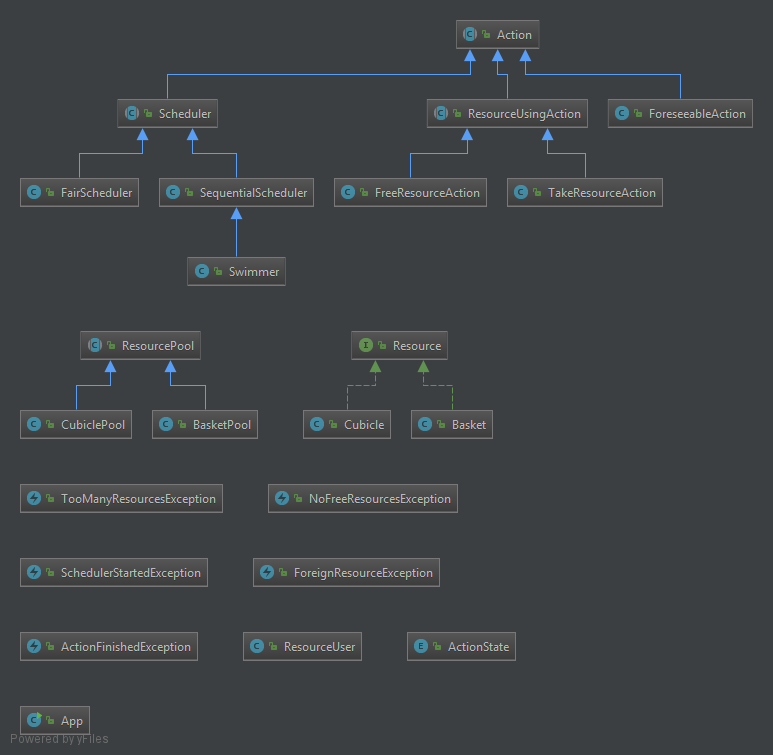
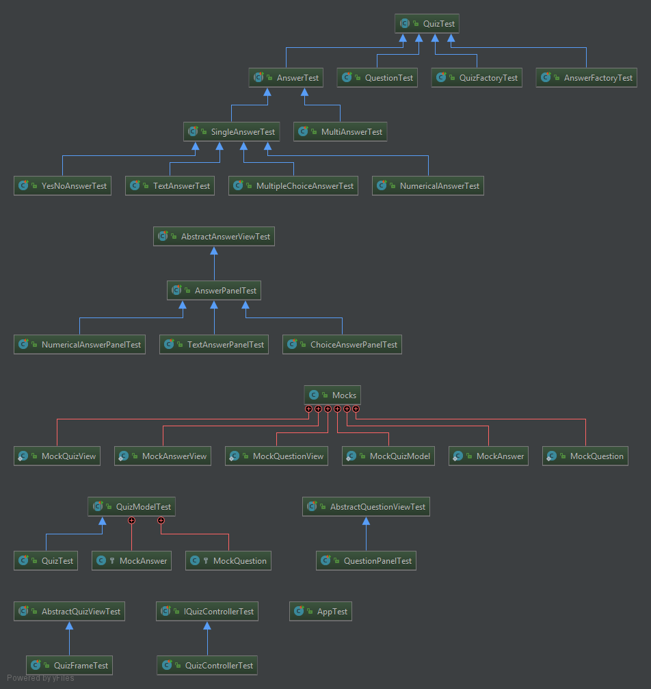

Bienvenue sur notre TP Piscine
===================

----------

Mini projet réalisé dans le cadre de la Conception Orienté Objet par Christopher Caroni et Leprêtre Guillaume. Ce projet sera évalué par notre professeur de TD Quentin Baert. Dans ce tp, vous pouvez gérer une piscine...

# Composition du TP :

- Une archive `Maven`
- Le code source dans `src/main`
- Les tests unitaire dans `src/test`
- Les différents UML dans `/diagrams`
- Le `README.md` de ce tp

# Mise en place du tp:

- Télécharger l'archive à l'aide de la commande `git clone`
-  Compiler avec la commande `mvn package`
- Vous pouvez générer la javadoc avec la commande `mvn javadoc:javadoc`
- Pour lancer le programme, exécuter la commande  `java -jar COO-Pool-1.0-SNAPSHOT.jar` dans le dossier `target`

# Diposition des classes

Si vous voulez voir des détails spécifique sur nos UML, diriger vous dans le dossier `/diagrams` où vous trouverez des UML pour les différents package.

Vous pouvez voir ci-dessous l'UML complet de notre projet :

# Tests

Lors de la réalisation de notre tp, nous avons déveloper en `TDD` (Test Driven Developement) où le but est de coder les tests avant de coder les différentes méthodes.
Cette méthode est souvent utilisé dans les entreprises et à l'avantage de ne jamais être surpris d'un `bug`. En effet, le but est de réalisé les tests et le code pas à pas et de vérifier le tout en executant ces tests. Par conséquent, si le test ne fonctionne pas, le problème viens soit de la `méthode/classe` créer, soit du `test`. 

Vous pouvez voir ci-dessous que les tests exécutés sont correcte :

Master branch:

Dev branch:

Vous pouvez voir ci-dessous l'UML des différents test: 

