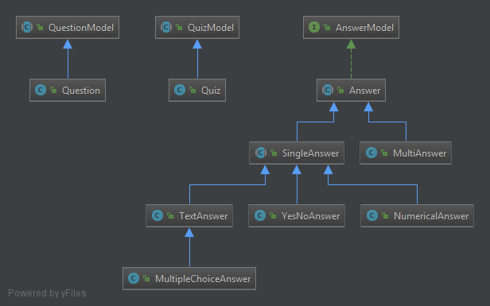
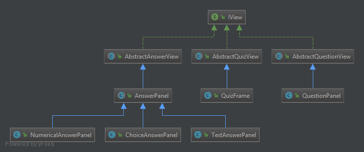
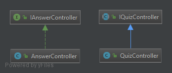
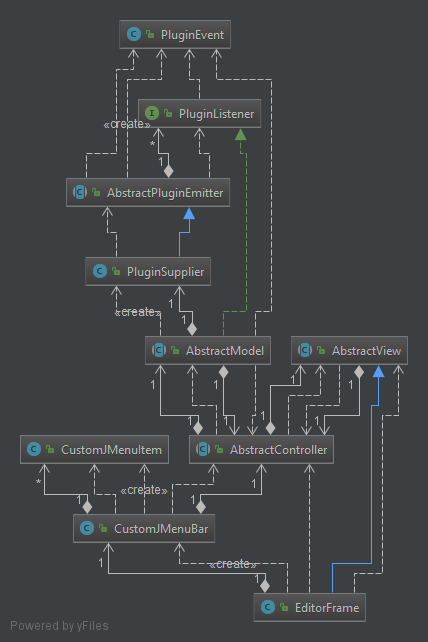

Bienvenue sur notre TP Plugins
===================

----------

Mini projet réalisé dans le cadre de la Conception Orienté Objet par Christopher Caroni et Leprêtre Guillaume. Ce projet sera évalué par notre professeur de TD Quentin Baert. Dans ce tp, nous avons créer un petit éditeur de texte qui implémente des plugins

# Composition du TP :

- `6 modules Maven` représentant les différents exercices du TP dont un commun à tous
- Dans chaque modules, le code source se trouve dans `src/main`
- De même pour les tests unitaire dans `src/test`
- Les différents UML dans `/diagrams`. Attention: tous les diagrammes ne sont pas présentés dans ce readme car elles n'apportent pas forcément
plus d'aide à la compréhension de l'architecture du projet.
- Le `README.md` de ce tp

# Mise en place du TP :

- Télécharger l'archive à l'aide de la commande `git clone`
- Compiler les différents modules avec la commande `mvn package` ou `mvn clean install`
- Vous pouvez générer la javadoc avec la commande `mvn javadoc:javadoc`
- Pour lancer le programme, déplacer vous dans le module `EXERCICE-5`
- Exécuter la commande suivante `java -jar target/EXERCICE-5-1.0-SNAPSHOT.jar repository`

# Diposition des classes :

L'architecture principale de ce projet se définit grâce à la structure MVC qui est présentée ci dessous:
## Les modèles

## Les vues

## Le controlleur

# Tests :

Lors de la réalisation de notre tp, nous avons continuer de déveloper en `TDD` (Test Driven Developement).

Vous pouvez voir ci-dessous l'UML des différents test: 

## MVC

Pour la réalisation graphique, nous avons créer à nouveau une architecture `MVC` (Model View Controller) où le but est de séparer le projet en 3 parties :

- Le `modèle` qui est le corps des `données` où elles sont sont manipulés et stockées
- La `vue` représente le `modele graphique.` C'est ce que l'utilisateur va voir et où il va pouvoir intéragir avec notre quiz.
- Le `controlleur` va reçoit des évenements de la vue, récupère les données de l'utilisateur et les vérifies contre les données du modèle. Ensuite, il peut notifier la vue du résultat.

Vous pouvez voir ci-dessous les classes présentes dans notre mvc ci-dessous :

