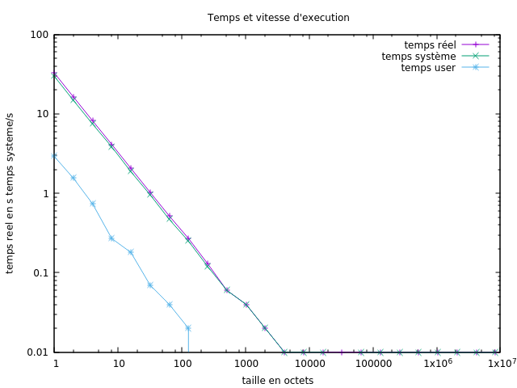

#   Performances des entrées/sorties

Ce répertoire correspond aux exercices de la section
[Performances des entrées/sorties](http://www.fil.univ-lille1.fr/~hym/e/pds/tp/tdfs-perfio.html).

# Ce que nous avons fait :

Durant ce tp nous avons:
- crée la commande `mcat-scd`
- crée la commande `mcat-scs`
- crée la commande `mcat-lib`
- crée la commande `mcat-fsync`
- pour toutes les commandes nous avons testé leurs performances par le biais d'un shell

Ainsi ici vous pouvez voir les différents graphique que nous produis gnuplot:
Il faut noter que ce n'est que pour mcat-scd que la taille du buffer change. Tous les autres ont un buffer de taille statique et donc chaque nouveau point selon l'axe horizontale représente un
nouveau test sur le même fichier

Performances pour mcat-scd:
